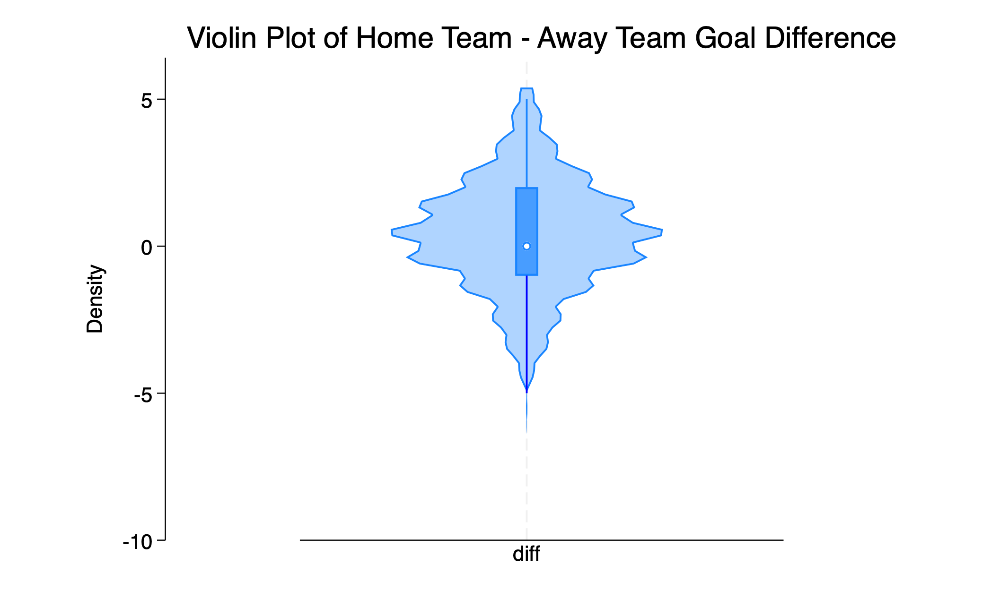
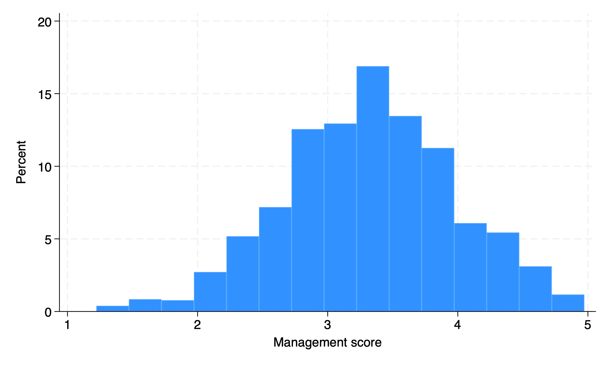
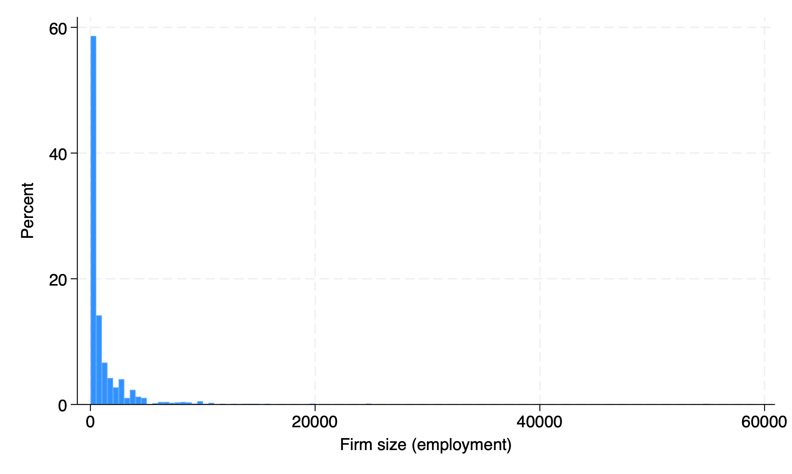
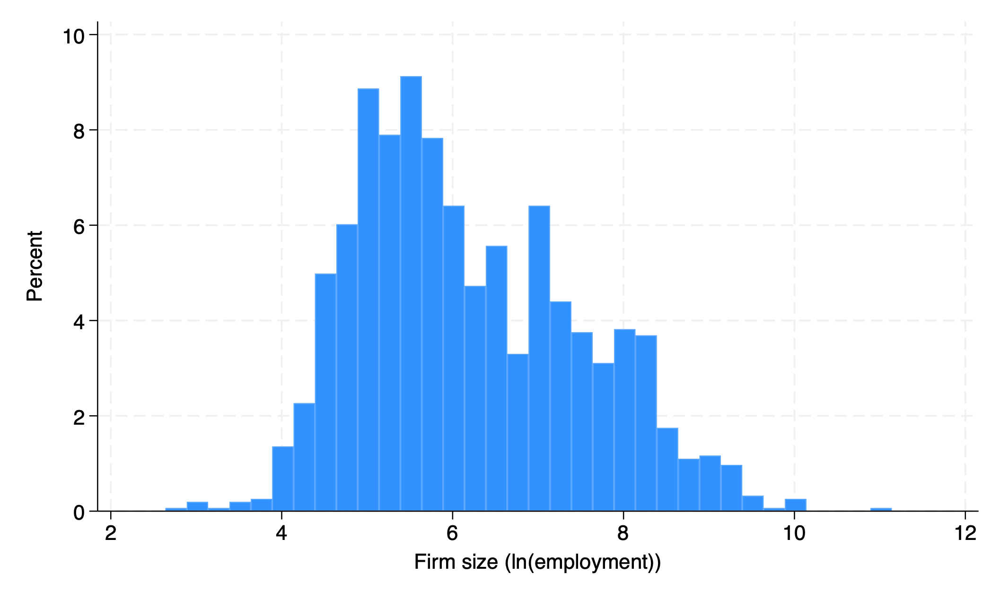

# Report for homework 3
## Football

I produced a violin plot using the vioplot library. The graph is similar to the histogram presented in the textbook, but it provides additional information by showing the quantiles. The mean home team advantage is 0.39 goals per game, with a standard deviation of 1.9 goals. The advantage is insignificant compared to a 0 advantage. It is also difficult to discern an obvious home team advantage from the graph, as the density plot appears quite symmetrical, and the median advantage is 0. However, the 25th percentile has a slightly larger absolute value than the 75th percentile.

## Management Survey
I picked the United States, and reproduced the three graphs below. 

The mean(3.3) and median(3.25-3.5) managemenr score of United States are both higher than Mexico. Comparing two graphs, it seems that the U.S. firms have better management than Mexican firms in general. 

The sizes of U.S. firms are generally much larger than Mexican firms. The most striking fact is that the largest firm in the U.S. is 10 times larger than the largest firm in Mexico. The size distribution in the U.S. is also more skewed to the right than in Mexico, which makes histogram plotting difficult.

The histogram of the natural log of firm size has much better visibility than the previous histogram. It shows that the mean and median log size of U.S. firms are actually similar to those of Mexican firms. The much higher mean size of U.S. firms is driven by extremely large companies, which act as outliers.